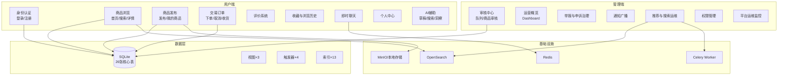
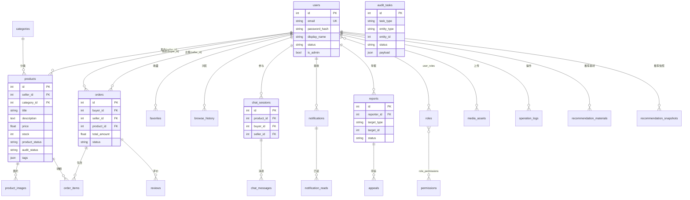

# 高级二手交易平台 — 数据库课程设计报告（需求分析 · 总体设计 · 详细设计）

> 项目名称：Advanced Marketplace（高级二手交易平台）  
> 技术栈：Vue 3 + FastAPI + SQLite + Redis + OpenSearch + Celery  
> 访问地址：http://localhost:5173（开发）/ http://localhost:8080（Nginx 统一入口）

---

## 二、需求分析

### 2.1 项目背景与目标

本系统面向校园/社区闲置物品交易场景，解决传统线下交易信息分散、缺乏审核与信用体系的问题。系统需支持用户注册登录、商品发布与审核、搜索推荐、在线下单、即时聊天、评价收藏，以及管理员对商品审核、举报申诉、通知广播和平台运维的全流程管理。

### 2.2 用户角色

| 角色 | 说明 | 典型账号 |
|------|------|----------|
| 访客 | 未登录，可浏览商品与搜索 | — |
| 普通用户 | 已登录，可同时作为买家与卖家 | buyer@example.com / Buyer123! |
| 卖家 | 普通用户发布商品时的身份 | seller@example.com / Seller123! |
| 审核员 | 拥有商品审核、举报/申诉处理权限 | moderator@example.com / Mod123456! |
| 管理员 | 拥有全部后台权限 | admin@example.com / Admin123! |

### 2.3 功能需求概述

1. **身份认证**：邮箱注册、登录、JWT 会话、RBAC 角色权限。
2. **商品管理**：发布/编辑/下架、图片上传、分类标签、审核状态流转。
3. **搜索推荐**：关键词搜索、联想提示、首页推荐、相关商品、浏览历史驱动推荐。
4. **交易流程**：下单扣库存、取消恢复库存、确认收货、商品/卖家双评价。
5. **用户互动**：收藏、浏览历史、买卖双方即时聊天、在线状态、通知中心。
6. **内容治理**：用户举报、申诉复核、审核任务队列、操作日志留痕。
7. **智能辅助**：AI 生成商品草稿、搜索辅助、购买洞察、聊天 Copilot。
8. **平台运维**：统计概览、推荐/搜索索引重建、基础设施健康检查。

### 2.4 功能模块图

```
                        ┌─────────────────────────────────────┐
                        │     高级二手交易平台（Advanced Marketplace）      │
                        └─────────────────────────────────────┘
                                              │
              ┌───────────────────────────────┼───────────────────────────────┐
              │                               │                               │
     ┌────────▼────────┐             ┌────────▼────────┐             ┌────────▼────────┐
     │    用户端模块    │             │    管理端模块    │             │    系统支撑模块   │
     └────────┬────────┘             └────────┬────────┘             └────────┬────────┘
              │                               │                               │
   ┌──────────┼──────────┐         ┌─────────┼─────────┐         ┌───────────┼───────────┐
   │          │          │         │         │         │         │           │           │
┌──▼──┐  ┌───▼───┐  ┌──▼──┐  ┌───▼───┐ ┌──▼──┐  ┌───▼───┐  ┌───▼───┐  ┌───▼───┐  ┌───▼───┐
│身份 │  │商品   │  │交易 │  │审核   │ │举报 │  │通知   │  │SQLite │  │Redis  │  │OpenSearch│
│认证 │  │浏览   │  │订单 │  │中心   │ │申诉 │  │运营   │  │数据库 │  │缓存   │  │全文检索  │
│     │  │发布   │  │评价 │  │统计   │ │治理 │  │       │  │       │  │       │  │         │
└──┬──┘  └───┬───┘  └──┬──┘  └───┬───┘ └──┬──┘  └───┬───┘  └───┬───┘  └───┬───┘  └───┬───┘
   │         │         │         │        │         │          │          │          │
┌──▼──┐  ┌───▼───┐  ┌──▼──┐  ┌───▼───┐ ┌──▼──┐  ┌───▼───┐  ┌───▼───┐  ┌───▼───┐  ┌───▼───┐
│收藏 │  │搜索   │  │聊天 │  │权限   │ │推荐 │  │平台   │  │视图   │  │Celery │  │MinIO  │
│历史 │  │推荐   │  │通知 │  │管理   │ │运维 │  │运维   │  │触发器 │  │异步   │  │媒体   │
│     │  │AI辅助 │  │     │  │       │ │     │  │       │  │索引   │  │任务   │  │存储   │
└─────┘  └───────┘  └─────┘  └───────┘ └─────┘  └───────┘  └───────┘  └───────┘  └───────┘
```

**Mermaid 功能模块图（可导出为图片插入报告）：**



---

## 三、总体设计

### 3.1 系统架构

系统采用前后端分离架构：

- **前端**：Vue 3 + Vite + Pinia + Element Plus，按用户端 `/` 与管理端 `/admin` 分区。
- **后端**：FastAPI + SQLAlchemy ORM，RESTful API 前缀 `/api`。
- **数据库**：SQLite（`backend/data/advanced_marketplace.db`），静态 SQL 脚本位于 `backend/database/sql/`。
- **中间件**：Redis（缓存/在线状态）、OpenSearch（商品全文检索）、Celery（推荐/索引异步重建）、MinIO（对象存储）。

### 3.2 数据库 ER 图

数据库共 **26 张核心表**，按业务域划分如下。



### 3.3 实体关系说明

#### 3.3.1 身份与权限域

| 实体 | 关系 | 说明 |
|------|------|------|
| users ↔ roles | M:N（user_roles） | 一个用户可拥有多个角色 |
| roles ↔ permissions | M:N（role_permissions） | 角色绑定细粒度权限码 |
| users | 自引用 | 同时作为买家与卖家出现在 orders 中 |

#### 3.3.2 商品与交易域

| 实体 | 关系 | 说明 |
|------|------|------|
| categories → products | 1:N | 商品可选分类 |
| users → products | 1:N | 卖家发布多件商品 |
| products → product_images | 1:N | 一件商品多张图片 |
| orders | 关联 buyer、seller、product | 一单对应一个主商品 |
| orders → order_items | 1:N | 订单明细行 |
| orders → reviews | 1:N | 订单完成后可评价 |

#### 3.3.3 互动与治理域

| 实体 | 关系 | 说明 |
|------|------|------|
| users ↔ products | M:N（favorites） | 收藏，唯一约束 (user_id, product_id) |
| chat_sessions → chat_messages | 1:N | 会话内消息流 |
| reports → appeals | 1:N | 举报后可申诉 |
| audit_tasks | 多态引用 | entity_type + entity_id 指向商品/申诉等 |

#### 3.3.4 关系图（表级）

```
users ─────┬──── products ──── product_images
           │         │
           │         ├── categories
           │         │
           ├──── orders ──── order_items
           │         │
           │         └── reviews
           │
           ├── favorites ──── products
           ├── browse_history ──── products
           ├── chat_sessions ──── chat_messages
           ├── notifications ──── notification_reads
           ├── reports ──── appeals
           ├── user_roles ──── roles ──── role_permissions ──── permissions
           ├── media_assets
           ├── operation_logs
           ├── recommendation_materials
           └── recommendation_snapshots

audit_tasks（独立队列，多态关联）
domain_events / job_run_logs / ai_task_logs（运维日志）
```

### 3.4 状态机设计

| 对象 | 状态枚举 | 流转说明 |
|------|----------|----------|
| 商品 product_status | DRAFT → ACTIVE → OFF_SHELF / BLOCKED | 审核通过后上架，卖家可下架 |
| 商品 audit_status | PENDING → APPROVED / REJECTED / CHANGES_REQUESTED | 管理员审核驱动 |
| 订单 status | CREATED → COMPLETED / CANCELLED | 下单扣库存，取消恢复，确认收货完成 |
| 举报 status | PENDING → PROCESSED | 管理员处理后写入 decision |
| 申诉 status | PENDING → APPROVED / REJECTED | 复核举报处理结果 |

---

## 四、详细设计

### 4.1 数据库对象设计

SQL 资源按 `init.sql` 建议顺序执行：`tables.sql` → `indexes.sql` → `views.sql` → `triggers.sql` → `seed_data.sql`。

#### 4.1.1 数据表（26 张）

| 业务域 | 表名 | 中文说明 |
|--------|------|----------|
| 身份权限 | users, roles, permissions, user_roles, role_permissions | 用户账号与 RBAC |
| 商品目录 | categories, products, product_images | 分类、商品、图片 |
| 交易 | orders, order_items, reviews | 订单、明细、评价 |
| 用户行为 | favorites, browse_history | 收藏、浏览足迹 |
| 聊天 | chat_sessions, chat_messages | 买卖会话与消息 |
| 通知 | notifications, notification_reads | 事件通知与已读 |
| 治理 | reports, appeals, audit_tasks, operation_logs | 举报、申诉、审核队列、操作日志 |
| 推荐/AI | recommendation_materials, recommendation_snapshots, ai_task_logs | 推荐数据与 AI 日志 |
| 基础设施 | media_assets, domain_events, job_run_logs | 媒体元数据、领域事件、任务日志 |

> **【截图 DB-1】数据库表结构总览**  
> 工具：DB Browser for SQLite 或 `sqlite3 backend/data/advanced_marketplace.db`  
> 操作：打开数据库 → 「数据库结构」标签页 → 截取全部 26 张表列表  
> 说明：展示系统完整表清单

> **【截图 DB-2】核心表字段详情 — products**  
> 操作：选中 `products` 表 → 查看列定义（seller_id、audit_status、product_status、tags 等）  
> 说明：展示商品表主键、外键与 CHECK 约束

> **【截图 DB-3】核心表字段详情 — orders**  
> 操作：选中 `orders` 表 → 查看 buyer_id、seller_id、product_id、status 字段  
> 说明：展示订单表多外键关联设计

#### 4.1.2 索引（13 个）

| 索引名 | 表.列 | 用途 |
|--------|-------|------|
| idx_users_email | users(email) | 登录邮箱快速查找 |
| idx_products_seller_id | products(seller_id) | 卖家商品列表 |
| idx_products_title | products(title) | 标题检索辅助 |
| idx_orders_buyer_id | orders(buyer_id) | 买家订单列表 |
| idx_orders_product_id | orders(product_id) | 商品关联订单 |
| idx_reviews_product_id | reviews(product_id) | 商品评价聚合 |
| idx_chat_messages_session_id | chat_messages(session_id) | 会话消息分页 |
| idx_notifications_user_id | notifications(user_id) | 用户通知列表 |
| idx_reports_reporter_id | reports(reporter_id) | 举报人记录 |
| idx_appeals_report_id | appeals(report_id) | 申诉关联举报 |
| idx_audit_tasks_entity | audit_tasks(entity_type, entity_id) | 审核任务定位 |
| idx_recommendation_snapshots_scene | recommendation_snapshots(scene) | 推荐场景查询 |
| idx_domain_events_type | domain_events(event_type) | 事件类型统计 |

> **【截图 DB-4】索引列表**  
> 操作：在 DB Browser 的「索引」标签页，或执行 `SELECT name, tbl_name FROM sqlite_master WHERE type='index';`  
> 说明：展示 13 个业务索引

#### 4.1.3 视图（3 个）

| 视图名 | 用途 |
|--------|------|
| v_product_overview | 商品概览：关联卖家名、分类名、价格、库存、审核/上架状态 |
| v_order_summary | 订单摘要：买家/卖家显示名、商品标题、金额、状态 |
| v_governance_queue | 治理队列：按 task_type、entity_type、status 统计 audit_tasks 数量 |

> **【截图 DB-5】视图 v_product_overview 查询结果**  
> SQL：`SELECT * FROM v_product_overview LIMIT 10;`  
> 说明：展示视图联表查询效果，含 seller_name、category_name 列

> **【截图 DB-6】视图 v_order_summary 查询结果**  
> SQL：`SELECT * FROM v_order_summary LIMIT 10;`  
> 说明：展示订单摘要视图，含 buyer_name、seller_name、product_title

> **【截图 DB-7】视图 v_governance_queue 查询结果**  
> SQL：`SELECT * FROM v_governance_queue;`  
> 说明：展示审核任务队列统计

#### 4.1.4 触发器（4 个）

| 触发器 | 触发时机 | 功能 |
|--------|----------|------|
| trg_products_updated_at | AFTER UPDATE ON products | 自动更新 updated_at |
| trg_orders_updated_at | AFTER UPDATE ON orders | 自动更新 updated_at |
| trg_audit_tasks_updated_at | AFTER UPDATE ON audit_tasks | 自动更新 updated_at |
| trg_reports_operation_log | AFTER INSERT ON reports | 举报提交时自动写入 operation_logs |

> **【截图 DB-8】触发器定义**  
> 操作：DB Browser「数据库结构」→ 展开某表触发器，或执行 `.schema trg_reports_operation_log`  
> 说明：展示举报触发器自动写操作日志的逻辑

> **【截图 DB-9】触发器验证 — 举报后 operation_logs**  
> 操作：在前端商品详情页提交一条举报 → 查询 `SELECT * FROM operation_logs WHERE action='report.submit' ORDER BY id DESC LIMIT 5;`  
> 说明：验证 trg_reports_operation_log 触发器实际生效

---

### 4.2 功能模块详细设计与界面截图说明

以下各节说明模块功能，并标注应截取的页面。**截图时建议浏览器宽度 1440px，登录对应演示账号。**

---

#### 4.2.1 身份认证模块

**功能说明**：支持邮箱注册与登录，后端签发 JWT Token，前端 Pinia 持久化会话；启动时调用 `/auth/me` 恢复用户状态。

**涉及数据表**：users

| 截图编号 | 截取页面 | 操作步骤 | 说明要点 |
|----------|----------|----------|----------|
| UI-1 | 登录页 | 访问 http://localhost:5173/login | 展示邮箱/密码表单与注册入口 |
| UI-2 | 注册页 | 访问 /register，填写表单 | 展示新用户注册界面 |
| UI-3 | 登录成功 | 使用 buyer@example.com 登录后跳转首页 | 展示顶栏用户头像与导航菜单 |

---

#### 4.2.2 商品浏览与搜索模块

**功能说明**：首页展示推荐商品；搜索页支持关键词检索与联想；商品详情页展示图片、价格、成色、卖家卡片；登录用户浏览时自动记录 browse_history。

**涉及数据表**：products, product_images, categories, browse_history, recommendation_snapshots

| 截图编号 | 截取页面 | 操作步骤 | 说明要点 |
|----------|----------|----------|----------|
| UI-4 | 首页 | 访问 / | 展示商品卡片网格、推荐区域 |
| UI-5 | 搜索结果页 | 顶栏搜索框输入「数码」→ 回车 | 展示搜索关键词与结果列表 |
| UI-6 | 商品详情页 | 点击任意商品进入 /products/:id | 展示图片轮播、价格、描述、卖家信息、购买按钮 |
| UI-7 | AI 购买洞察 | 在商品详情页展开 AI 洞察面板 | 展示 AI 辅助购买建议（若 API 可用） |

---

#### 4.2.3 商品发布与管理模块

**功能说明**：卖家发布/编辑商品，上传图片，可调用 AI 生成标题与描述草稿；提交后进入审核队列；支持下架与修改后重新提交。

**涉及数据表**：products, product_images, media_assets, audit_tasks

| 截图编号 | 截取页面 | 操作步骤 | 说明要点 |
|----------|----------|----------|----------|
| UI-8 | 发布商品页 | 登录 seller 账号 → 访问 /publish | 展示标题、描述、价格、分类、图片上传表单 |
| UI-9 | AI 生成草稿 | 在发布页点击「AI 生成草稿」 | 展示 AI 自动填充标题/描述的效果 |
| UI-10 | 我的商品 | 访问 /my-products | 展示卖家商品列表及各商品审核/上架状态 |
| UI-11 | 下架确认弹窗 | 在「我的商品」点击「下架」 | 展示居中灰色毛玻璃 ConfirmDialog 确认弹窗（v1.4 统一风格） |

---

#### 4.2.4 交易订单模块

**功能说明**：买家在商品详情页下单，系统扣减库存创建 CREATED 订单；买家可取消（恢复库存）或确认收货（状态变 COMPLETED）；买卖双方在「我的订单」查看。

**涉及数据表**：orders, order_items, products

| 截图编号 | 截取页面 | 操作步骤 | 说明要点 |
|----------|----------|----------|----------|
| UI-12 | 下单操作 | 商品详情页点击「立即购买」 | 展示下单成功提示或跳转订单页 |
| UI-13 | 我的订单 | 访问 /orders | 展示订单列表、状态标签、操作按钮 |
| UI-14 | 确认收货弹窗 | 点击「确认收货」 | 展示 ConfirmDialog 确认弹窗 |
| UI-15 | 取消订单弹窗 | 点击「取消订单」 | 展示取消确认弹窗 |

---

#### 4.2.5 评价模块

**功能说明**：订单 COMPLETED 后，买家可对商品和卖家分别评分（1–5 星）并写评论；商品详情页与卖家主页公开展示评价。

**涉及数据表**：reviews

| 截图编号 | 截取页面 | 操作步骤 | 说明要点 |
|----------|----------|----------|----------|
| UI-16 | 提交评价 | 在已完成订单卡片点击「评价」 | 展示评分与评论表单 |
| UI-17 | 商品评价列表 | 商品详情页滚动至评价区 | 展示历史评价与均分 |

---

#### 4.2.6 收藏与浏览历史模块

**功能说明**：用户收藏感兴趣的商品；系统自动记录最近浏览；个人中心可查看收藏列表与浏览足迹。

**涉及数据表**：favorites, browse_history

| 截图编号 | 截取页面 | 操作步骤 | 说明要点 |
|----------|----------|----------|----------|
| UI-18 | 收藏商品 | 商品详情页点击「收藏」图标 | 展示收藏成功状态 |
| UI-19 | 我的收藏 | 访问 /favorites | 展示收藏商品卡片列表 |
| UI-20 | 取消收藏弹窗 | 点击「取消收藏」 | 展示 ConfirmDialog 确认弹窗 |
| UI-21 | 浏览历史 | 访问 /history | 展示最近浏览商品列表 |

---

#### 4.2.7 即时聊天模块

**功能说明**：买家在商品详情页发起与卖家的聊天会话；支持 WebSocket 实时消息、在线/隐身/离线状态；集成 AI 会话摘要与 Copilot。

**涉及数据表**：chat_sessions, chat_messages

| 截图编号 | 截取页面 | 操作步骤 | 说明要点 |
|----------|----------|----------|----------|
| UI-22 | 发起聊天 | 商品详情页点击「联系卖家」 | 展示跳转消息页并选中对应会话 |
| UI-23 | 消息中心 | 访问 /messages | 展示左侧会话列表 + 右侧聊天窗口 |
| UI-24 | 发送消息 | 在聊天框输入并发送 | 展示消息气泡与发送时间 |

---

#### 4.2.8 个人中心模块

**功能说明**：聚合展示收藏数、浏览数、未读消息、进行中订单等工作台数据，提供各功能快捷入口。

**涉及数据表**：users + 各业务表聚合

| 截图编号 | 截取页面 | 操作步骤 | 说明要点 |
|----------|----------|----------|----------|
| UI-25 | 个人中心 | 访问 /profile | 展示工作台统计卡片与快捷入口 |
| UI-26 | 卖家主页 | 访问 /sellers/:sellerId | 展示卖家资料、信任徽章、在售商品 |

---

#### 4.2.9 举报模块

**功能说明**：登录用户在商品详情页提交举报，写入 reports 表；触发器自动记录 operation_logs；管理员在后台处理。

**涉及数据表**：reports, operation_logs, audit_tasks

| 截图编号 | 截取页面 | 操作步骤 | 说明要点 |
|----------|----------|----------|----------|
| UI-27 | 提交举报 | 商品详情页点击「举报」并填写原因 | 展示举报表单与提交成功提示 |

---

#### 4.2.10 管理端 — 审核中心

**功能说明**：管理员/审核员查看待办审核队列，对商品执行通过、驳回、要求修改；可强制下架；查看操作日志与统计图表。

**涉及数据表**：audit_tasks, products, operation_logs

| 截图编号 | 截取页面 | 操作步骤 | 说明要点 |
|----------|----------|----------|----------|
| UI-28 | 管理后台入口 | admin@example.com 登录 → 访问 /admin | 展示管理端侧边栏导航 |
| UI-29 | 审核队列 | /admin/audits | 展示待处理审核任务列表 |
| UI-30 | 商品审核 | /admin/products → 点击某商品「进入处理」 | 展示审核详情、通过/驳回按钮、ConfirmDialog 弹窗 |
| UI-31 | 运营概览 | /admin/dashboard | 展示 ECharts 统计图表（订单量、商品数等） |
| UI-32 | 操作日志 | /admin/operations | 展示 operation_logs 前端呈现 |

---

#### 4.2.11 管理端 — 举报与申诉治理

**功能说明**：管理员查看用户举报列表，填写处理决定；复核用户申诉，关联原始举报与审核任务。

**涉及数据表**：reports, appeals, audit_tasks

| 截图编号 | 截取页面 | 操作步骤 | 说明要点 |
|----------|----------|----------|----------|
| UI-33 | 举报管理 | /admin/reports | 展示举报列表、状态、处理入口 |
| UI-34 | 举报处理 | 点击某条举报「处理」 | 展示处理表单与时间线 |
| UI-35 | 申诉管理 | /admin/appeals | 展示申诉列表与复核操作 |

---

#### 4.2.12 管理端 — 通知运营

**功能说明**：管理员向全体用户或指定用户发送广播通知，配置跳转目标（如 /orders）。

**涉及数据表**：notifications, admin_notification_broadcasts

| 截图编号 | 截取页面 | 操作步骤 | 说明要点 |
|----------|----------|----------|----------|
| UI-36 | 通知广播 | /admin/notifications | 展示广播表单与历史记录 |
| UI-37 | 用户通知 | 普通用户顶栏点击通知铃铛 | 展示收到管理员广播的通知 |

---

#### 4.2.13 管理端 — 推荐与搜索运维

**功能说明**：查看推荐物料与快照；触发 Celery 异步任务重建推荐索引与 OpenSearch 全文索引；查看 AI Provider 状态。

**涉及数据表**：recommendation_materials, recommendation_snapshots, job_run_logs

| 截图编号 | 截取页面 | 操作步骤 | 说明要点 |
|----------|----------|----------|----------|
| UI-38 | 推荐工作台 | /admin/recommendations | 展示推荐数据与重建按钮 |
| UI-39 | 索引重建 | 点击「重建搜索索引」 | 展示任务触发成功提示 |

---

#### 4.2.14 管理端 — 权限管理与平台运维

**功能说明**：管理员为用户分配 ADMIN/MODERATOR 角色；平台运维页展示 DB/Redis/Celery/Storage/Search 健康状态。

**涉及数据表**：users, roles, permissions, user_roles, role_permissions

| 截图编号 | 截取页面 | 操作步骤 | 说明要点 |
|----------|----------|----------|----------|
| UI-40 | 权限管理 | /admin/access | 展示用户列表与角色分配界面 |
| UI-41 | 平台运维 | /admin/platform | 展示各基础设施就绪状态面板 |

---

### 4.3 核心业务流程测试说明

#### 4.3.1 商品发布—审核—上架流程

```
卖家发布商品(DRAFT/PENDING)
    → 写入 products + product_images
    → 生成 audit_tasks 审核任务
    → 管理员审核(APPROVED)
    → product_status 变为 ACTIVE
    → 商品出现在首页/搜索
```

> **【截图 TEST-1】流程串联**  
> 依次截取：发布页(UI-8) → 我的商品待审核(UI-10) → 管理端审核通过(UI-30) → 首页可见(UI-4)

#### 4.3.2 完整交易流程

```
买家浏览商品 → 下单(CREATED, 扣库存)
    → 买家确认收货(COMPLETED)
    → 提交商品/卖家评价
    → 写入 reviews + recommendation_materials
```

> **【截图 TEST-2】流程串联**  
> 依次截取：商品详情(UI-6) → 我的订单(UI-13) → 确认收货(UI-14) → 提交评价(UI-16)

#### 4.3.3 举报—日志—治理流程

```
用户提交举报 → INSERT reports
    → 触发器写 operation_logs
    → 生成 audit_tasks
    → 管理员处理举报(UI-34)
```

> **【截图 TEST-3】流程串联**  
> 依次截取：提交举报(UI-27) → 数据库 operation_logs(DB-9) → 管理端举报列表(UI-33)

---

### 4.4 截图清单汇总

| 类别 | 编号范围 | 数量 | 获取方式 |
|------|----------|------|----------|
| 数据库对象 | DB-1 ~ DB-9 | 9 | DB Browser / sqlite3 CLI |
| 用户端界面 | UI-1 ~ UI-27 | 27 | 浏览器访问 localhost:5173 |
| 管理端界面 | UI-28 ~ UI-41 | 14 | admin 账号访问 /admin |
| 流程测试 | TEST-1 ~ TEST-3 | 3 | 多步骤串联截图 |
| **合计** | | **53** | |

---

### 4.5 演示账号速查

| 角色 | 邮箱 | 密码 |
|------|------|------|
| 买家 | buyer@example.com | Buyer123! |
| 卖家 | seller@example.com | Seller123! |
| 审核员 | moderator@example.com | Mod123456! |
| 管理员 | admin@example.com | Admin123! |

---

### 4.6 数据库截图操作指南

1. 安装 [DB Browser for SQLite](https://sqlitebrowser.org/)（或使用命令行 `sqlite3`）。
2. 打开文件：`backend/data/advanced_marketplace.db`。
3. 若视图为空，先执行 SQL 脚本：
   ```bash
   cd backend/database/sql
   sqlite3 ../../data/advanced_marketplace.db < views.sql
   sqlite3 ../../data/advanced_marketplace.db < triggers.sql
   ```
4. 在「执行 SQL」标签页运行查询语句，结果区截图即可。

---

*本报告依据项目源码 `backend/database/sql/`、`backend/app/models/`、`frontend/src/router/` 及前后端 API 路由整理，界面截图需在实际运行环境中按上述编号自行截取后插入 Word/PPT 文档。*
